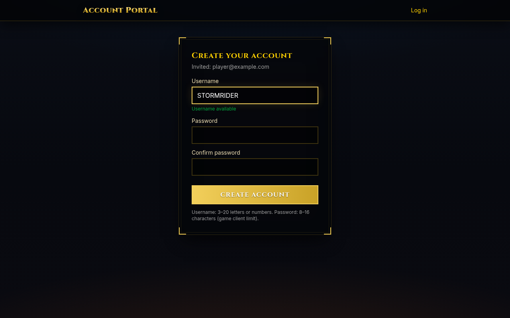
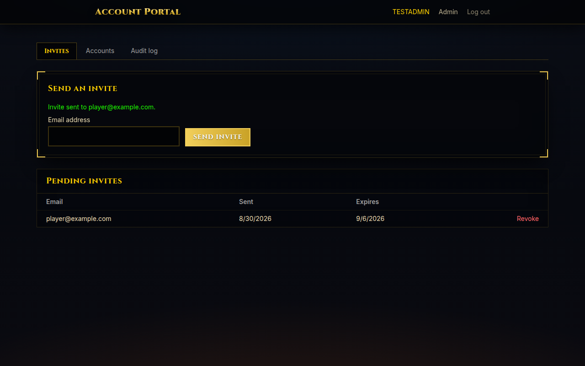
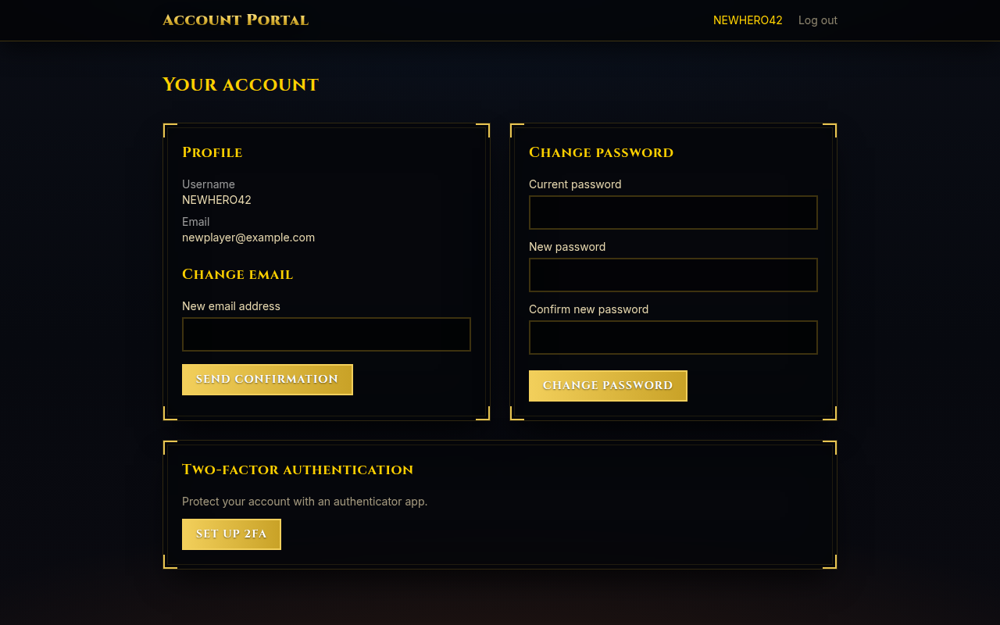
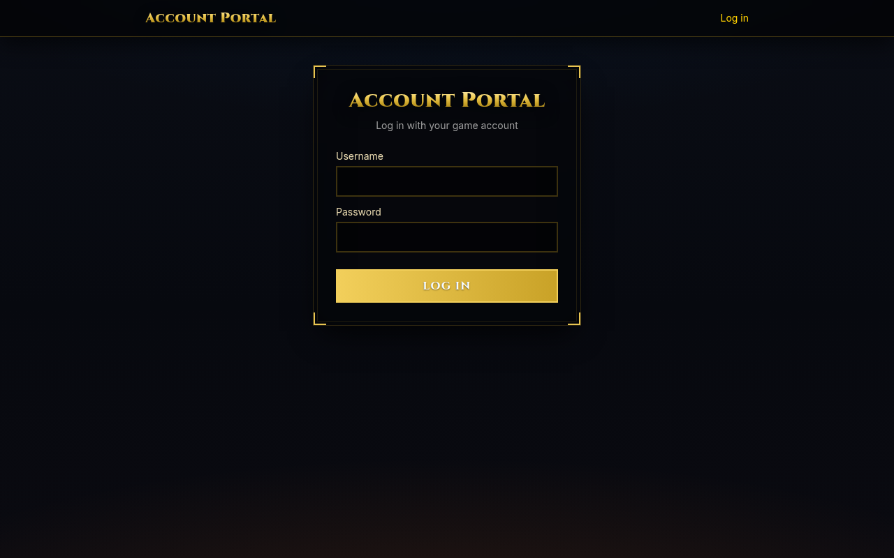

# AzerothCore Account Portal

The AzerothCore Account Portal is a self-service invitation and account-management web
app for any existing AzerothCore server. Players use it to register a game account from an
admin-issued invite link, change their password, and turn two-factor authentication on or
off — all without shell or database access. Guild officers and server admins get a small
admin area to issue invites, review accounts, promote other admins, and read an audit log
of who changed what. The portal never touches the game database directly: every account
mutation goes through the worldserver's SOAP command interface, and the only direct MySQL
access is a read-only user against `acore_auth` for looking up accounts. It ships as two
containers — a FastAPI backend and a SvelteKit frontend — that join your AzerothCore
stack's Docker network so they can reach the worldserver and MySQL by service name.

## Screenshots

| Invite registration | Admin — invites |
| --- | --- |
|  |  |

| Account self-service | Login |
| --- | --- |
|  |  |

## Prerequisites

- Any AzerothCore deployment on Docker Compose, with the worldserver and MySQL containers
  on a shared Docker network. The defaults assume the common `ac-worldserver` /
  `ac-mysql` service names; adjust `PORTAL_SOAP_URL` and `PORTAL_ACORE_AUTH_URL` if yours
  differ. (For example, the
  [AzerothCore-RealmMaster](https://github.com/uprightbass360/AzerothCore-RealmMaster)
  stack works out of the box with `COMPOSE_OVERRIDE_SOAP_ENABLED=1` set.)
- SOAP enabled on the worldserver: `SOAP.Enabled = 1` in the worldserver config, listening
  on port 7878 (or whatever port you point `PORTAL_SOAP_URL` at).
- An SMTP relay the portal can send through (invite emails). Any relay you already
  control works — a real provider, an internal relay, or a local `postfix`/`msmtp`
  container.

## One-time AzerothCore setup

Do this once against your existing stack, before starting the portal.

**1. Create a dedicated SOAP GM account.** The portal authenticates its SOAP calls as a
game account with GM level 3, separate from any human GM account. From the worldserver
console:

```
account create portalsoap <strong-password>
account set gmlevel portalsoap 3 -1
```

Use this account's name and password as `PORTAL_SOAP_USER` / `PORTAL_SOAP_PASS` below.

**2. Create a read-only MySQL user for `acore_auth`.** The portal only ever `SELECT`s
account rows to look up usernames, emails, and lock state — it never writes to MySQL
directly. From the stack's `ac-mysql` container:

```bash
docker exec -it ac-mysql mysql -uroot -p -e "CREATE USER 'portal_ro'@'%' IDENTIFIED BY 'CHANGE_ME'; GRANT SELECT ON acore_auth.* TO 'portal_ro'@'%';"
```

Use the same password in `PORTAL_ACORE_AUTH_URL` below.

**3. Verify the SOAP commands your build supports.** Different AzerothCore builds carry
different console command sets. From the worldserver console, run:

```
help account set
```

Confirm `account set 2fa <username> off` is listed — the portal relies on it to disable
2FA server-side. Also check whether `account set email <username> <email> <email>` exists.
If your build does not have `account set email`, the portal's `SoapClient.set_email` call
will fault; the accepted fallback is to make `set_email` a no-op that returns `""` and
keep the email address portal-side only, updating `SoapClient.set_email` and its tests
accordingly. Do this check before pointing the portal at a stack you care about.

## Install

```bash
cp .env.template .env
```

Fill in `.env`: `ACORE_NETWORK` with the name of the Docker network your
AzerothCore stack runs on (find it with `docker network ls` — it's usually
`<project>_default`), `PORTAL_ACORE_AUTH_URL` with the
`portal_ro` password from step 2 above, `PORTAL_SOAP_USER`/`PORTAL_SOAP_PASS` from step 1,
your SMTP settings, `PORTAL_PUBLIC_BASE_URL` (the URL players will use — this also doubles
as the frontend's CSRF origin, so get it right), and `PORTAL_INTERNAL_API_KEY` (generate
one with `openssl rand -hex 32`).

Then start both containers. CI publishes prebuilt images to Docker Hub on every
`main` push (`uprightbass360/azerothcore-account-portal-backend` / `-frontend`,
tagged `latest` and by commit SHA), so on a server you can pull instead of building:

```bash
docker compose pull && docker compose up -d
```

Or build locally from source:

```bash
docker compose up -d --build
```

Check the backend came up cleanly — you should see the alembic migration run followed by
the uvicorn startup line:

```bash
docker compose logs backend
```

Once that looks healthy, visit `http://<host>:8080` (or whatever `PORTAL_HTTP_PORT` you
set) in a browser. You should land on the login page.

## First admin

Before the first start, set `PORTAL_ADMIN_USERNAMES` in `.env` to your own game account
name (the one you'll register through an invite, or that already exists in `acore_auth`).
The backend seeds this list as portal admins on every startup, matching by account name.
Once you've registered and logged in as that account, you'll see the admin area and can
issue invites and promote further admins from the UI — you don't need to edit
`PORTAL_ADMIN_USERNAMES` again after that.

## External access via a reverse proxy

The portal has no TLS of its own — put any reverse proxy you control in front of
the frontend port (Pangolin, Caddy, nginx, Traefik, ...) and set two variables:

1. `PORTAL_PUBLIC_BASE_URL` — the exact public URL users will hit, e.g.
   `https://wow.example.com:442`. This one setting drives the CSRF origin check,
   the `Secure` cookie flag, and the links in invite emails.
2. `PORTAL_ADDRESS_HEADER=x-forwarded-for` — so login rate limiting and the
   audit log record real visitor IPs instead of the proxy's. Only set this when
   a proxy you control fronts the portal and always sets the header; it is
   spoofable from direct connections. `PORTAL_XFF_DEPTH` (default 1) matches
   one proxy hop.

Point the proxy at the frontend port (`PORTAL_HTTP_PORT`, default 8080). The
backend stays unexposed either way. Then `docker compose up -d` to apply.

Before exposing the portal publicly, also replace any test SMTP (e.g. MailHog)
with a real relay — invite emails must actually reach recipients.

## Backups

The portal's own data (invites, admin flags, audit log) lives in a single SQLite file on
the `appdata` volume. Back it up with:

```bash
docker run --rm -v <project>_appdata:/data -v $(pwd):/backup alpine cp /data/portal.db /backup/portal-$(date +%F).db
```

Replace `<project>_appdata` with your actual volume name (`docker volume ls` if unsure —
by default it's `<compose-project-name>_appdata`). Game accounts themselves are not stored
by the portal at all; they live in your AzerothCore stack's own `acore_auth` database, so
back that up through your existing MySQL backup process, not through this one.

## Development

Backend:

```bash
cd backend
uv run fastapi dev app/main.py   # needs a dev stack, or PORTAL_* env vars pointing at one
uv run pytest
```

Frontend:

```bash
cd frontend
npm run dev
npx vitest run --coverage
```

End-to-end tests against a full stack live in `frontend/e2e/` (Playwright) and need a
running backend plus admin credentials — see the env vars checked at the top of
`frontend/e2e/portal.spec.ts`. Without them, `npx playwright test` cleanly skips.

## Security model

Every account mutation — creating an account, setting a password, toggling 2FA — is
performed exclusively through the worldserver's SOAP interface using a dedicated GM
account, so the portal never writes to the game database directly; its only direct MySQL
access is a `SELECT`-only user scoped to `acore_auth` for read lookups. The frontend and
backend containers communicate over an internal Docker network using a shared internal API
key (`PORTAL_INTERNAL_API_KEY`) that the browser never sees, while player-facing auth is
handled with server-side sessions issued after password (and optional TOTP) verification.

## Verifying the deployment

The checks below need a live AzerothCore stack — run them after your first real
deployment.

**Health endpoint against the real stack.** With the portal joined to your stack's
network and `.env` filled in with real credentials:

```bash
curl -fsS -H "X-Internal-Key: $PORTAL_INTERNAL_API_KEY" http://<backend-container-ip>:8000/api/v1/health
# or, from inside the frontend container:
docker compose exec frontend wget -qO- http://backend:8000/api/v1/health
```

Confirm the response is `{"status": "ok", "checks": {"acore_auth": "ok", "soap": "ok", ...}}`.
`acore_auth` failing means the `portal_ro` MySQL user or `PORTAL_ACORE_AUTH_URL` is wrong;
`soap` failing means the worldserver isn't reachable at `PORTAL_SOAP_URL` or the
`portalsoap` GM account/credentials are wrong.

**Worldserver console SOAP command support.** From the worldserver console, run
`help account set` and confirm:

- `account set 2fa <username> off` is accepted — this is required for the portal's
  "disable 2FA" flow to work.
- Whether `account set email <username> <email> <email>` exists. If it does not, apply the
  fallback noted above: make `SoapClient.set_email` a no-op returning `""` and keep the
  email address portal-side only, and update its tests to match.
